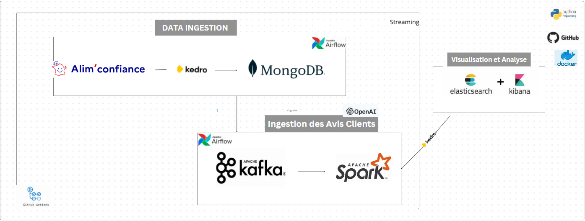

# Projet Intégré : Évaluation de la Qualité et de la Perception des Restaurants

## Objectif du Projet
Ce projet vise à combiner les données de conformité sanitaire fournies par l'API **Alim'confiance** avec l'analyse des sentiments des **avis clients** pour offrir une vue d'ensemble de la qualité des établissements de restauration. Cette approche permettrait d'identifier des corrélations entre les évaluations sanitaires officielles et la perception des consommateurs, offrant ainsi une vision complète pour améliorer la sécurité et la satisfaction client.

## Technologies Utilisées

# Technologies Utilisées

# Technologies Utilisées

### Langage

### Frameworks et Outils de Développement

### Cloud & Bases de Données

### Analyse des Sentiments & Intelligence Artificielle

### Bibliothèques de Données & Machine Learning

### Outils de Visualisation

### Conteneurisation et Déploiement

### Outils de Débogage et de Terminal

---
Ces outils ont été utilisés pour le développement du projet Realtime Restaurant Insights, visant à ingérer, transformer, et analyser des données en temps réel pour obtenir des insights sur les avis clients de différents restaurants. Le traitement des données en temps réel est facilité par Kafka, tandis que l'analyse des sentiments est effectuée grâce à l'API d'OpenAI, et les données sont ensuite indexées et visualisées à l'aide d'Elasticsearch, MongoDB, et Kibana.

## Architecture du Projet

### Workflow et Schéma d'Architecture

1. **Ingestion des Données de Contrôles Sanitaires (API Alim'confiance)** :
   - Extraction des informations sur les établissements et leurs contrôles sanitaires via l'API Alim'confiance, envoi des données dans Kafka.

2. **Ingestion des Avis Clients** :
   - Extraction d'avis clients à partir de sources disponibles (plateformes d'avis ou réseaux sociaux, dans le respect des règles d'utilisation).
   - Envoi des avis dans Kafka pour une ingestion en flux continu.

3. **Traitement des Données** :
   - **Analyse des Sentiments** : Utilisation de l'API OpenAI pour identifier le sentiment général (positif, neutre, négatif) et les sentiments par aspect (qualité de la nourriture, service, ambiance).
   - **Transformation des Données** : Spark nettoie et enrichit les données, en ajoutant des informations telles que la date, la région, le département et le type d’établissement.

4. **Indexation et Stockage** :
   - Les données enrichies sont stockées dans Elasticsearch, indexées par établissement, par date, par région, et par catégorie (avis clients et contrôles sanitaires).

5. **Visualisation et Analyse** :
   - Kibana est utilisé pour créer des tableaux de bord interactifs, permettant de suivre la conformité sanitaire et l’expérience client en temps réel.

## Fonctionnalités du Projet

1. **Suivi des Contrôles Sanitaires**
   - **Objectif** : Fournir une vue d’ensemble des niveaux d’hygiène pour chaque établissement.
   - **Description** : Identifier les établissements avec des niveaux "à corriger de manière urgente" ou "à améliorer" pour cibler les interventions nécessaires.

2. **Analyse des Sentiments des Avis Clients**
   - **Objectif** : Quantifier le sentiment des clients pour chaque établissement en fonction de l'expérience (service, nourriture, ambiance).
   - **Description** : Évaluer les avis clients pour chaque aspect du service, afin d'identifier des tendances et des aspects nécessitant une amélioration.

3. **Corrélation entre Sentiment Client et Hygiène Sanitaire**
   - **Objectif** : Identifier les corrélations entre la satisfaction des clients et le niveau de conformité sanitaire.
   - **Description** : Analyser si les établissements avec de meilleures pratiques sanitaires obtiennent des avis plus positifs, ou si un mauvais niveau d'hygiène entraîne une perception négative dans les avis.

4. **Analyse Géographique et Temporelle**
   - **Objectif** : Identifier les zones géographiques avec des tendances sanitaires ou de satisfaction particulières, ainsi que l’évolution de la perception des établissements au fil du temps.
   - **Description** : Créer des cartes géographiques dans Kibana pour visualiser les établissements à risque et les sentiments des clients par région.

5. **Rapports et Indicateurs de Qualité**
   - **Objectif** : Créer des rapports consolidés sur la qualité globale des établissements et générer des indicateurs (ex. score de conformité, score de satisfaction).
   - **Description** : Agréger les scores de conformité et de satisfaction pour chaque établissement pour créer un tableau de classement des restaurants.

## Déroulement Technique du Projet

### Extraction et Ingestion
   - **Données de l’API Alim'confiance** : Extraction des données sanitaires avec Python et envoi dans Kafka.
   - **Avis clients** : Extraction et validation de conformité des données d'avis, envoi dans Kafka.

### Traitement avec Spark
   - **Analyse des sentiments** : Utilisation de l'API OpenAI pour analyser les sentiments des avis clients.
   - **Enrichissement** : Ajout d'informations temporelles et géographiques aux données sanitaires et aux avis clients.

### Stockage et Indexation avec Elasticsearch
   - Stockage des données d’établissement, des niveaux d’hygiène et des avis clients dans Elasticsearch.

### Visualisation avec Kibana
   - Création de tableaux de bord pour :
     - Suivre la répartition des niveaux d’hygiène.
     - Visualiser les sentiments des clients.
     - Suivre les corrélations et les tendances.

## Analyses et Indicateurs Attendus

1. **Indice de Conformité et de Satisfaction** : Calculer un score global pour chaque établissement en fonction de la conformité sanitaire et des sentiments clients.
2. **Corrélations entre Hygiène et Sentiment** : Identifier si les établissements mal notés pour leur hygiène ont aussi des avis négatifs des clients.
3. **Zones à Risque** : Localiser les zones géographiques où les niveaux d'hygiène et les avis clients sont insatisfaisants.
4. **Tendances Temporelles** : Analyser l’évolution dans le temps des niveaux de satisfaction et des niveaux d’hygiène.

## Exemples de Cas d'Usage

- **Pour les autorités** : Prioriser les contrôles dans les zones ou établissements avec des niveaux d'hygiène et de satisfaction faible.
- **Pour les restaurateurs** : Identifier les aspects (hygiène ou service) à améliorer pour répondre aux attentes des clients.
- **Pour les analystes** : Suivre les tendances régionales en matière de conformité sanitaire et de satisfaction client.

## Déploiement

- **Docker** : Conteneurisation des services (Kafka, Spark, Elasticsearch, Kibana) pour simplifier le déploiement et le scaling.
- **Configurations** : Variables d’API et paramètres de stockage configurables via des fichiers `.env`.
- **Automatisation** : Script de déploiement pour exécuter le pipeline complet.

## Améliorations Futures

1. **Machine Learning pour la prédiction des niveaux de conformité** : Utilisation de modèles pour anticiper les besoins d'inspection.
2. **Intégration d'autres sources d'avis (réseaux sociaux)** : Agrégation d'avis de sources variées pour enrichir les données.
3. **Développement d’une API** : Fournir un accès en temps réel aux indicateurs de qualité des établissements pour des applications externes.

---

